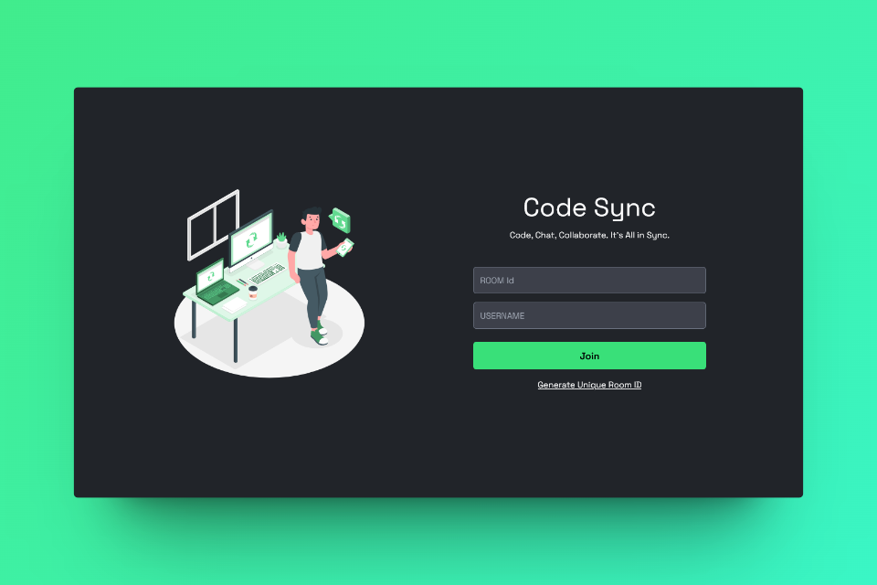

<div align="center">

# Code Sync

### Real-Time Collaborative Code Editor

[](https://opensource.org/licenses/MIT)
[](https://www.typescriptlang.org/)
[](https://react.dev/)
[](https://socket.io/)
[](https://tailwindcss.com/)

A powerful, real-time collaborative coding platform built for pair programming, code reviews, and team collaboration. Join any room with a unique Room ID and see changes instantly synced across all participants.

[Live Demo](https://code-syncer.vercel.app) | [Report Bug](https://github.com/harshitGuptaj/code-Syncer/issues) | [Request Feature](https://github.com/harshitGuptaj/code-Syncer/issues)

</div>

---

## Live Demonstration

> **Try it now:** [https://code-syncer.vercel.app](https://code-syncer.vercel.app)



### How It Works

1. **Create a Room** - Enter your name and click "Create Room" to get a unique Room ID
2. **Share the ID** - Send the Room ID to your collaborators
3. **Start Coding** - Everyone in the room sees changes in real-time
4. **Collaborate** - Use the AI Copilot, chat, drawing board, and code execution

---

## Features

- **Real-Time Code Syncing** - Instant synchronization of code changes across all participants using WebSockets
- **Multi-Language Support** - Execute code in 20+ programming languages including JavaScript, Python, Java, C++, Go, Rust, and more
- **AI Code Copilot** - Get AI-powered code suggestions and generation powered by Groq API
- **Collaborative Drawing** - Built-in whiteboard with tldraw for brainstorming and visual collaboration
- **In-Room Chat** - Real-time messaging system for team communication
- **File Management** - Create, rename, delete, and organize files and directories
- **Syntax Highlighting** - Beautiful code editing with CodeMirror and multiple theme support
- **User Presence** - See who's online, cursor positions, and typing indicators
- **Responsive Design** - Works seamlessly on desktop and tablet devices
- **Dark Theme** - Beautiful dark UI designed for extended coding sessions

---

## Tech Stack

### Frontend

| Technology | Purpose |
|------------|---------|
|  | UI Framework |
|  | Type Safety |
|  | Build Tool |
|  | Styling |
|  | Code Editor |
|  | Real-Time Communication |
|  | Drawing Board |
|  | Routing |

### Backend

| Technology | Purpose |
|------------|---------|
|  | Runtime |
|  | Web Framework |
|  | WebSocket Server |
|  | Type Safety |
|  | Code Execution |

---

## Project Structure

```
code-Syncer/
├── client/                    # Frontend React application
│   ├── src/
│   │   ├── api/               # API clients (Piston, Groq)
│   │   ├── assets/            # SVG illustrations and icons
│   │   ├── components/        # React components
│   │   │   ├── chats/         # Chat system
│   │   │   ├── common/        # Shared components
│   │   │   ├── connection/    # Connection status
│   │   │   ├── drawing/       # Whiteboard editor
│   │   │   ├── editor/        # Code editor with collaboration
│   │   │   ├── files/         # File structure management
│   │   │   ├── forms/         # Join/Create room forms
│   │   │   ├── sidebar/       # Sidebar navigation
│   │   │   ├── toast/         # Notifications
│   │   │   └── workspace/     # Main workspace layout
│   │   ├── context/           # React Context providers
│   │   ├── hooks/             # Custom React hooks
│   │   ├── pages/             # Page components
│   │   ├── resources/         # Themes and fonts
│   │   ├── styles/            # Global CSS
│   │   ├── types/             # TypeScript type definitions
│   │   └── utils/             # Utility functions
│   ├── .env.example           # Environment variables template
│   ├── package.json
│   ├── tailwind.config.ts
│   ├── tsconfig.json
│   └── vite.config.mts
│
├── server/                    # Backend Node.js server
│   ├── src/
│   │   ├── server.ts          # Express + Socket.IO server
│   │   └── types/             # TypeScript types
│   ├── .env.example           # Environment variables template
│   ├── package.json
│   └── tsconfig.json
│
├── docker-compose.yml         # Docker setup with Judge0
├── judge0.conf                # Judge0 configuration
├── package.json               # Root package.json
└── README.md
```

---

## Getting Started

### Prerequisites

- **Node.js** >= 18.x
- **npm** or **yarn**
- **Docker** (optional, for Judge0 code execution service)

### Installation

**1. Clone the repository**

```bash
git clone https://github.com/harshitGuptaj/code-Syncer.git
cd code-Syncer
```

**2. Install dependencies**

```bash
# Install client dependencies
cd client
npm install

# Install server dependencies
cd ../server
npm install
```

**3. Set up environment variables**

```bash
# Client
cd client
cp .env.example .env

# Server
cd ../server
cp .env.example .env
```

**4. Configure API keys** (Optional - for AI Copilot)

Edit `client/.env` and add your Groq API key:

```
VITE_GROQ_API_KEY=your_groq_api_key_here
```

> Get your free API key at [console.groq.com](https://console.groq.com)

### Running Locally

**Start the server:**

```bash
cd server
npm run dev
```

**Start the client (in a new terminal):**

```bash
cd client
npm run dev
```

The app will be available at `http://localhost:5173`

### Running with Docker

For the full experience with code execution support:

```bash
docker-compose up --build
```

This starts:
- Client at `http://localhost:5173`
- Server at `http://localhost:3000`
- Judge0 code execution at `http://localhost:2358`
- PostgreSQL database
- Redis cache

---

## Environment Variables

### Client (`client/.env`)

| Variable | Description | Default |
|----------|-------------|---------|
| `VITE_BACKEND_URL` | Backend server URL | `http://localhost:3000` |
| `VITE_PISTON_API_URL` | Piston API URL for code execution | `https://emkc.org/api/v2/piston` |
| `VITE_GROQ_API_KEY` | Groq API key for AI Copilot | `your_groq_api_key_here` |

### Server (`server/.env`)

| Variable | Description | Default |
|----------|-------------|---------|
| `PORT` | Server port | `3000` |
| `JUDGE0_URL` | Judge0 API URL | `https://ce.judge0.com` |

---

## Supported Languages

Code Sync supports code execution for **20+ programming languages**:

| Language | Version | Aliases |
|----------|---------|---------|
| JavaScript | 18.15.0 | js, node |
| TypeScript | 5.0.3 | ts |
| Python | 3.10.0 | py, python3 |
| Java | 15.0.2 | java |
| C | 10.2.0 | c |
| C++ | 10.2.0 | cpp, c++ |
| Go | 1.16.2 | go |
| Rust | 1.68.2 | rs, rust |
| Ruby | 3.0.1 | rb, ruby |
| PHP | 8.1.6 | php |
| Swift | 5.6.0 | swift |
| Kotlin | 1.8.0 | kt, kotlin |
| Bash | 5.2.0 | sh, bash |
| R | 4.1.1 | r |
| Perl | 5.34.0 | pl, perl |
| Haskell | 9.0.1 | hs, haskell |
| Lua | 5.4.4 | lua |
| Scala | 3.2.0 | scala |
| Elixir | 1.14.0 | ex, elixir |
| Erlang | 25.1 | erl, erlang |
| Clojure | 1.11.1 | clj, clojure |
| Dart | 2.19.6 | dart |
| C# | 6.12.0 | cs, c# |

---

## Architecture

```
┌──────────────┐     WebSocket      ┌──────────────┐
│              │◄──────────────────►│              │
│    Client    │     HTTP/REST      │    Server    │
│   (React)    │◄──────────────────►│  (Express)   │
│              │                    │              │
└──────┬───────┘                    └──────┬───────┘
       │                                    │
       │                                    │
       ▼                                    ▼
┌──────────────┐                    ┌──────────────┐
│  CodeMirror  │                    │   Judge0     │
│    Editor    │                    │   Service    │
└──────────────┘                    └──────────────┘
       │                                    │
       ▼                                    ▼
┌──────────────┐                    ┌──────────────┐
│  tldraw      │                    │  PostgreSQL  │
│  Drawing     │                    │  Database    │
└──────────────┘                    └──────────────┘
```

---

## API Endpoints

| Method | Endpoint | Description |
|--------|----------|-------------|
| GET | `/api/runtimes` | List supported programming languages |
| POST | `/api/execute` | Execute code snippet |

---

## Socket Events

| Event | Direction | Description |
|-------|-----------|-------------|
| `JOIN_REQUEST` | Client → Server | Request to join a room |
| `JOIN_ACCEPTED` | Server → Client | Successfully joined room |
| `FILE_CREATED` | Client → Server → Client | New file created |
| `FILE_UPDATED` | Client → Server → Client | File content changed |
| `FILE_DELETED` | Client → Server → Client | File deleted |
| `DIRECTORY_CREATED` | Client → Server → Client | New directory created |
| `SEND_MESSAGE` | Client → Server → Client | Chat message sent |
| `TYPING_START` | Client → Server → Client | User started typing |
| `CURSOR_MOVE` | Client → Server → Client | Cursor position changed |
| `DRAWING_UPDATE` | Client → Server → Client | Drawing board updated |

---

## Contributing

Contributions are welcome! Here's how to get started:

1. **Fork** the repository
2. **Create** a feature branch (`git checkout -b feature/amazing-feature`)
3. **Commit** your changes (`git commit -m 'Add amazing feature'`)
4. **Push** to the branch (`git push origin feature/amazing-feature`)
5. **Open** a Pull Request

---

## License

This project is licensed under the **MIT License** - see the [LICENSE](LICENSE) file for details.

---

## Acknowledgments

- [CodeMirror](https://codemirror.net/) - Code editor component
- [Socket.IO](https://socket.io/) - Real-time communication
- [tldraw](https://www.tldraw.com/) - Drawing and whiteboard
- [Judge0](https://judge0.com/) - Code execution engine
- [Groq](https://groq.com/) - AI/LLM inference API
- [Vercel](https://vercel.com/) - Deployment platform

---

<div align="center">

**Made with care by [Harshit Gupta](https://github.com/harshitGuptaj)**

</div>
